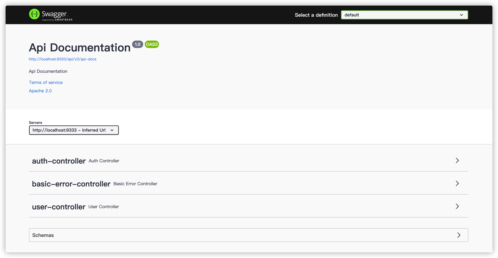
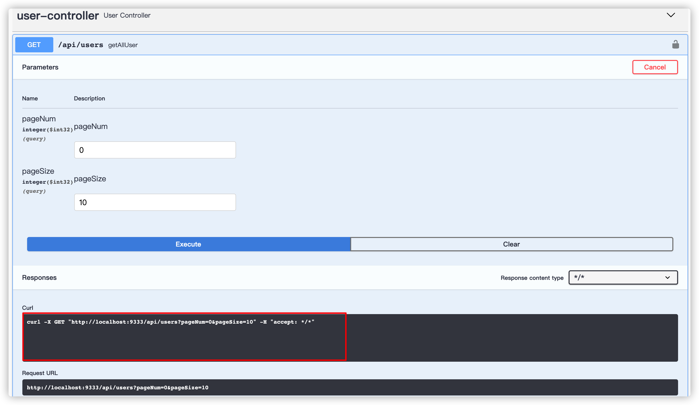
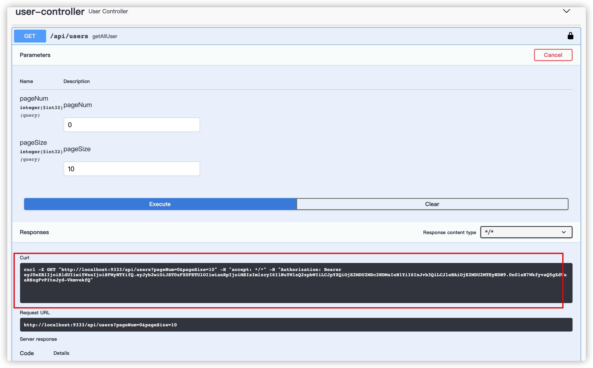
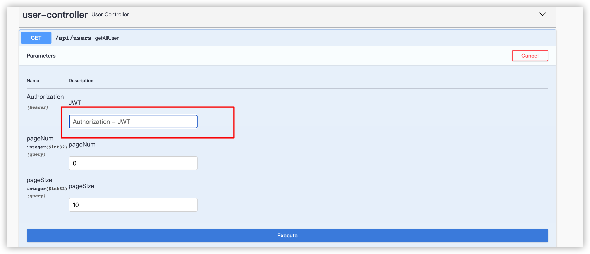

## Swagger 介绍

Swagger 是一套基于 OpenAPI 规范构建的开源工具，可以帮助我们设计、构建、记录以及使用 Rest API。

## 为什么要用 Swagger?

前后端分离的情况下，一份Rest API 文档将会极大的提高我们的工作效率。前端小伙伴只需要对照着 Rest API 文档就可以搞清楚一个接口需要的参数以及返回值。

通过 Swagger 我们只需要少量注解即可生成一份自带 UI 界面的 Rest API 文档，不需要我们后端手动编写。

并且，通过 UI 界面，我们还可以直接对相应的 API 进行调试,省去了准备复杂的调用参数的过程。

## SpringBoot项目中如何使用？

Swagger3.0官方已经有了自己的 Spring Boot Starter，只需要添加一个 jar 包即可。

```xml
<!-- swagger -->
<dependency>
    <groupId>io.springfox</groupId>
    <artifactId>springfox-boot-starter</artifactId>
    <version>3.0.0</version>
</dependency>
```

什么都不用配置！直接在浏览器中访问 :[http://ip:port/swagger-ui/](http://ip:port/swagger-ui/) 即可。




## Spring Security项目中如何使用？

如果你的项目使用了 Spring Security 做权限认证的话，你需要为 Swagger 相关url添加白名单。

```java
    String[] SWAGGER_WHITELIST = {
            "/swagger-ui.html",
            "/swagger-ui/*",
            "/swagger-resources/**",
            "/v2/api-docs",
            "/v3/api-docs",
            "/webjars/**"
    };

    @Override
    protected void configure(HttpSecurity http) throws Exception {
        http.cors().and()
                // 禁用 CSRF
                .csrf().disable()
                .authorizeRequests()
                // swagger
                .antMatchers(SWAGGER_WHITELIST).permitAll()
          ......
    }
```

另外，某些请求需要认证之后才可以访问，为此，我们需要对 Swagger 做一些简单的配置。

配置的方式非常简单，我提供两种不同的方式给小伙伴们。

1. 登录后自动为请求添加 token。
2. 为请求的Header添加一个认证参数，每次请求的时候，我们需要手动输入 token。

### 登录后自动为请求添加 token

通过这种方式我们只需要授权一次即可使用所有需要授权的接口。


```java
/**
 * @author shuang.kou
 * @description swagger 相关配置
 */
@Configuration
public class SwaggerConfig {

    @Bean
    public Docket createRestApi() {
        return new Docket(DocumentationType.SWAGGER_2)
                .apiInfo(apiInfo())
                .select()
                .apis(RequestHandlerSelectors.basePackage("github.javaguide.springsecurityjwtguide"))
                .paths(PathSelectors.any())
                .build()
                .securityContexts(securityContext())
                .securitySchemes(securitySchemes());
    }

    private List<SecurityScheme> securitySchemes() {
        return Collections.singletonList(new ApiKey("JWT", SecurityConstants.TOKEN_HEADER, "header"));
    }

    private List<SecurityContext> securityContext() {
        SecurityContext securityContext = SecurityContext.builder()
                .securityReferences(defaultAuth())
                .build();
        return Collections.singletonList(securityContext);
    }

    List<SecurityReference> defaultAuth() {
        AuthorizationScope authorizationScope
                = new AuthorizationScope("global", "accessEverything");
        AuthorizationScope[] authorizationScopes = new AuthorizationScope[1];
        authorizationScopes[0] = authorizationScope;
        return Collections.singletonList(new SecurityReference("JWT", authorizationScopes));
    }

    private ApiInfo apiInfo() {
        return new ApiInfoBuilder()
                .title("Spring Security JWT Guide")
                .build();
    }
}
```

**未登录前：**



**登录后：**



### 为请求的Header添加一个认证参数

每次请求的时候，我们需要手动输入 token到指定位置。



```java
@Configuration
public class SwaggerConfig {

    @Bean
    public Docket createRestApi() {
        return new Docket(DocumentationType.SWAGGER_2)
                .apiInfo(apiInfo())
                .select()
                .apis(RequestHandlerSelectors.basePackage("github.javaguide.springsecurityjwtguide"))
                .paths(PathSelectors.any())
                .build()
                .globalRequestParameters(authorizationParameter())
                .securitySchemes(securitySchemes());
    }

    private List<SecurityScheme> securitySchemes() {
        return Collections.singletonList(new ApiKey("JWT", SecurityConstants.TOKEN_HEADER, "header"));
    }

    private List<RequestParameter> authorizationParameter() {
        RequestParameterBuilder tokenBuilder = new RequestParameterBuilder();
        tokenBuilder
                .name("Authorization")
                .description("JWT")
                .required(false)
                .in("header")
                .accepts(Collections.singleton(MediaType.APPLICATION_JSON))
                .build();
        return Collections.singletonList(tokenBuilder.build());
    }

    private ApiInfo apiInfo() {
        return new ApiInfoBuilder()
                .title("Spring Security JWT Guide")
                .build();
    }
}
```

